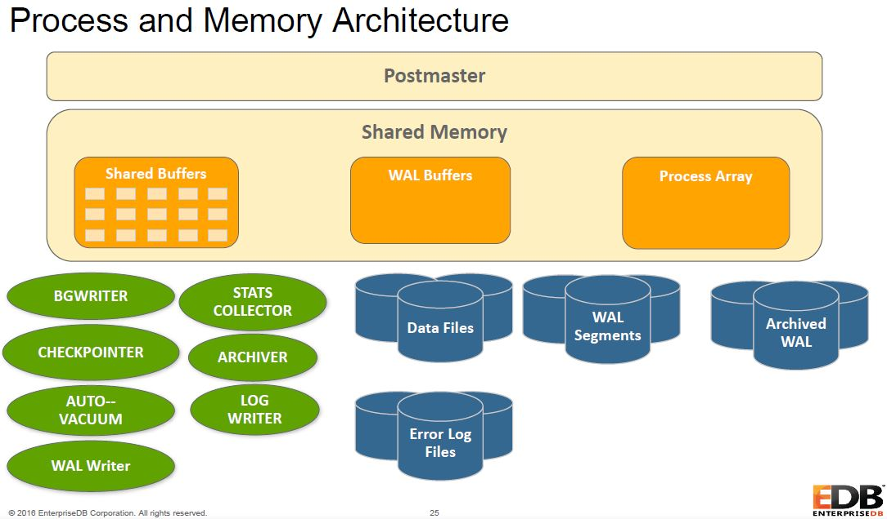
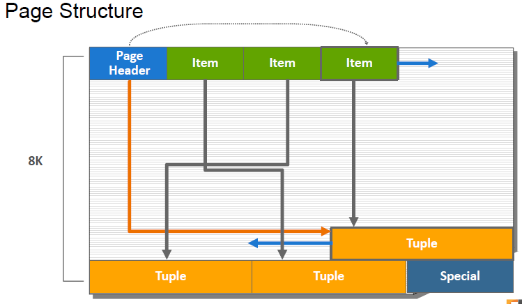

# Architecture

Postgres uses processes, not threads. One backend process per user
session. The ``postmaster`` process acts as supervisor, monitoring
utility processes.

Postmaster is master process called ``postgres``, listens on 1 only TCP
port (receives client connection requests). Default port: 5432 (or 5444
on Postgres Advanced Server). Postmaster is the **Listener**.
The postmaster must be configured to accept a connection from an IP
address.



## Utility processes

* Background writer - writes dirty data blocks to disk.
* WAL writer - flushes write ahead log to disk.
* Checkpointer process - auto. performs a checkpoint based on config
  parameters.
* Autovacuum launcher - starts Autovacuum workers as needed.
* Autovacuum workers - recovers free space for reuse.
* Logging collector - routes log messages to syslog, eventlog or files.
* Stats collector - collects usage statistics by relation and block.
* Archiver - archives write-ahead log files.

## User backend process

* Master process spawns a new server process for each connection request
  that is detected.
* Authentication: IP, user and password.
* Authorisation: verify user permissions.
* User backend process is called ``postgres`` (not Postmaster).
* Callback to client, wait for SQL.
* Query is transmitted using plain text.
* Info about the Postmaster process can be found in
  /usr/lib/postgresql/9.x/data/postmaster.pid

List Postgres processes:

    ps aux | grep postgres

## Disk buffering (read/write)

Postgres buffer cache (shared buffers in shared memory) reduces OS
reads. Single read IO is done on disk, cached in the buffer. Blocks are
written to disk only when needed: to make room for new block, or at
checkpoint time.

The background writer scan attempts to ensure an adequte supply of clean
buffers. Backend writes dirty buffers as needed to WAL buffers. Flushing
of WAL buffers happens periodically, on commit or when buffers are full.
WAL buffers are flushed to the Transaction log. Group commit can be
configured to reduce disk write IO.

## Commit and Checkpoint

* Before commit - uncommitted updates are in memory.
* After commit - committed updates written from shared memory to disk
  (write-ahead log file).
* After checkpoint - modified data pages are written from shared memory
  to the data files.

## Statement Processing

* Parse - check syntax, identify query type, command processor if req'd,
  break query into tokens.
* Optimise - planner generates plan, uses db statistics, query cost
  calculation, chooses best plan.
* Execute - execute query based on query plan.

# Physical database architecture

A cluster is a collection of databases managed by one server instance.
Each cluster has a separate data directory, TCP port and set of
processes. A single cluster can contain multiple databases.

On disk, there is a file per table and file per index. A table-space is
a directory on disk. Each database that uses a table-space gets a
subdirectory. Each relation (table) using that table-space/database
combo gets 1+ files in 1GB chunks. Each file name is a number that
increments when the file exceeds 1GB.

```sql
# Show all database OID and names:
select oid, datname from pg_database;
# Show a table file path:
select pg_relation_filepath('tablename');
```

## Page layout

A page is the smallest storage block on disk. By default, it is 8 kb.
It contains:

* Page header - general information, pointers to free space. 24b.
* Row/index pointers - array of offset/length pairs pointing to the
  actual rows/index entries. 24b.
* Free space - unallocated space.
* Row/index entry - actual row or index entry data.

Page structure:


